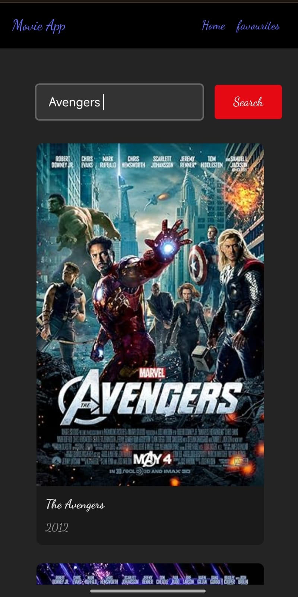

**Live Site**: [[https://your-netlify-site.netlify.app](https://cinelistapp.netlify.app/)]  
**GitHub Repo**: [STARRSOUL/Cinelist](https://github.com/STARRSOUL/Cinelist)

> A modern React-based movie search and discovery app using the OMDb API. Built with Vite, styled for clarity, and deployed on Netlify.

---

## 🚀 Features

- 🔍 Search any movie using the OMDb API
- 🌐 Responsive and clean UI built with React
- ⚡ Instant results and intuitive UX
- 🔁 Dynamic API fetching using `fetch()`
- ✅ Deployed live with Netlify
- 🔐 Updated to use HTTPS for production compatibility

---

## 📸 Preview

 

---

## 🛠 Tech Stack

| Frontend | Build Tool | API      | Deployment |
|----------|------------|----------|------------|
| React.js | Vite       | OMDb API | Netlify    |

---

## 🧠 What I Learned

- ⚙️ Component-based architecture in React
- 🌐 Handling external APIs securely
- 🎯 Debugging Netlify build and deployment issues
- 📁 File structure and Git case-sensitivity issues
- 🚧 Production issues like Mixed Content & HTTPS

---

## 🧑‍💻 Ideal For:

This project demonstrates:
- My React and API integration skills
- Real-world debugging and deployment experience
- Ownership of an end-to-end product

💼 I'm actively seeking **SDE internship opportunities**, and Cinelist represents my ability to:
- Build from scratch
- Deploy and troubleshoot
- Write scalable and readable code

---

## 📦 Setup Instructions

```bash
# Clone the repo
git clone https://github.com/STARRSOUL/Cinelist.git
cd Cinelist

# Install dependencies
npm install

# Run locally
npm run dev
Note: Make sure you’re using Node.js ≥ v18+ and have vite installed globally or via script.

🌐 Deployment
Deployed on Netlify using Vite's npm run build.
Includes _redirects file for SPA support.

📩 Contact
If you're hiring or want to collaborate, feel free to connect:

Email: anuragprasher7@gmail.com

LinkedIn: Anurag Parashar

🙌 Acknowledgements
OMDb API for movie data

Vite for lightning-fast build tooling
